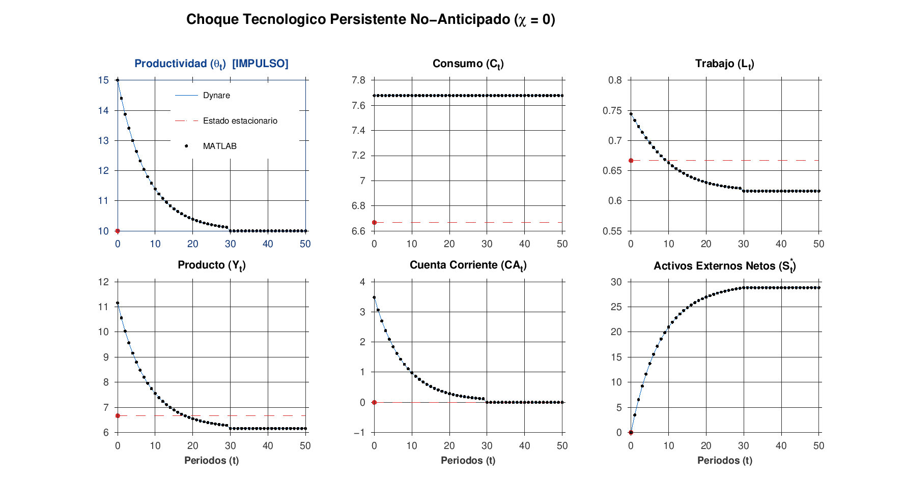
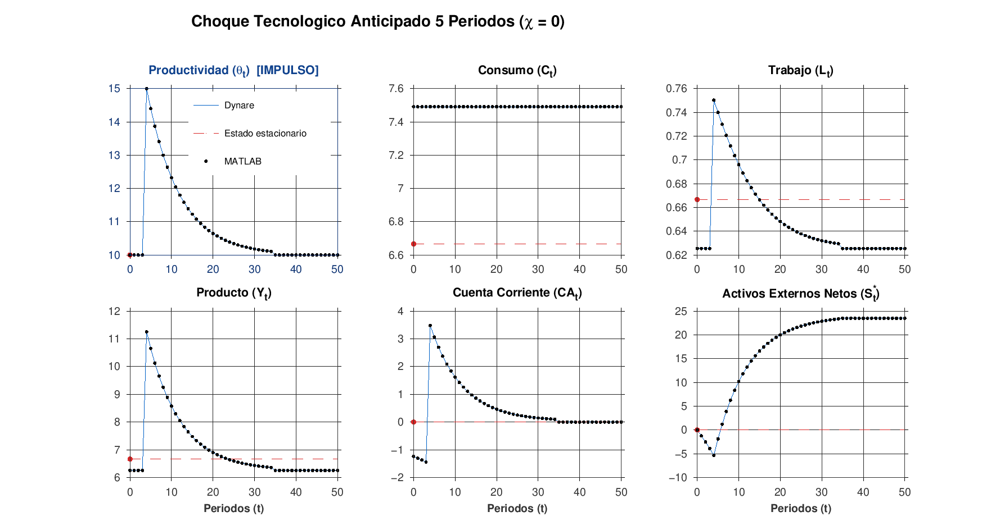
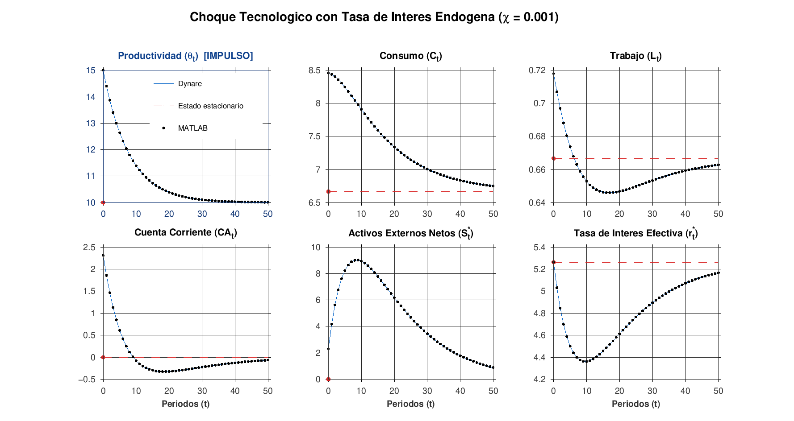
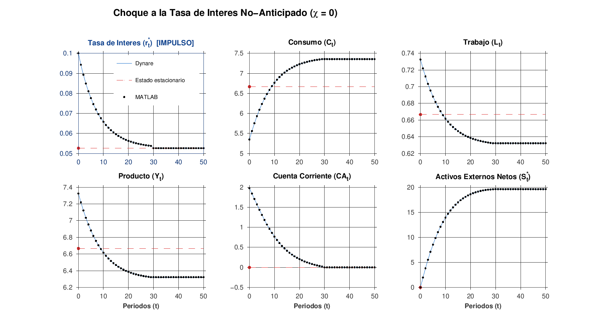
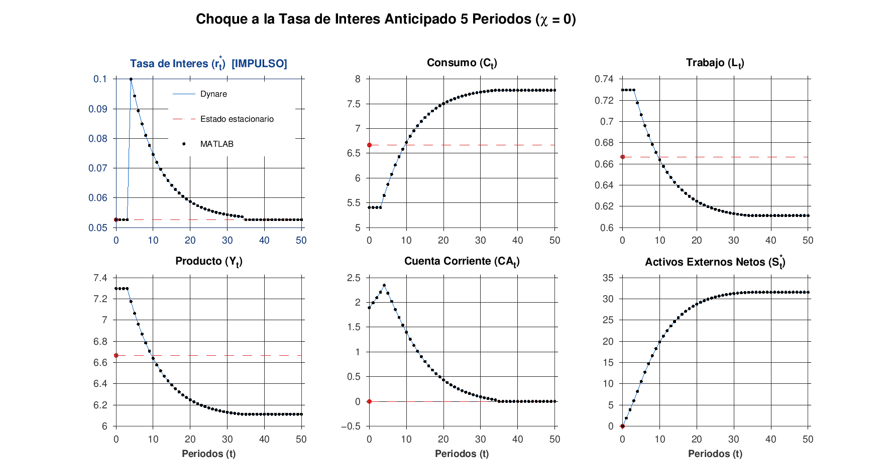
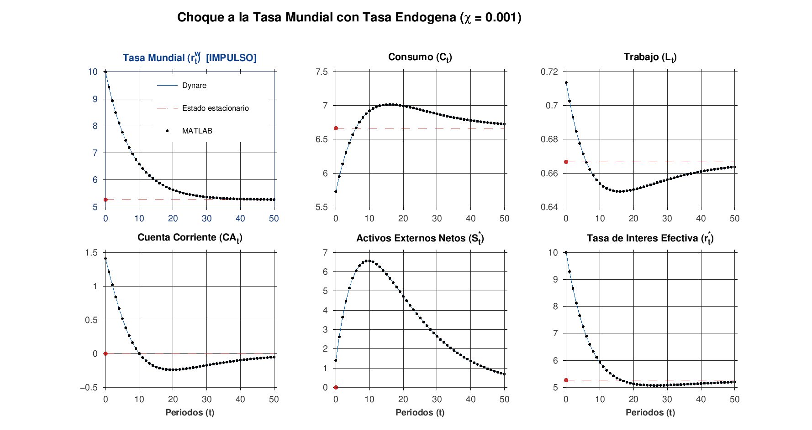

# Labs-Matlab-EcoIntII

Numerical solution of a deterministic small open economy (SOE) model with an
infinitely lived representative household and endogenous labor supply
(Tema B.1, Economia Internacional II). The codes compute the steady state and the
transition (impulse responses in levels) after productivity and world interest
rate shocks, with MATLAB and with Dynare.

| # | Experiment | $\chi$ | MATLAB (`Matlab/TemaB1_experimentos.m`) | Dynare |
|---|---|---|---|---|
| 1 | Productivity shock, unanticipated | 0 | `fsolve` | `Dynare/SOE_B1.mod` |
| 2 | Productivity shock, anticipated (announced in $t=1$, hits in $t=5$) | 0 | `fsolve` | `Dynare/SOE_B1.mod` |
| 3 | Productivity shock, unanticipated | 0.001 | Dynare model `Matlab/temaB1.mod` | `Dynare/SOE_B1b.mod` |
| 4 | World interest rate shock, unanticipated | 0 | `fsolve` | `Dynare/SOE_B1.mod` |
| 5 | World interest rate shock, anticipated (announced in $t=1$, hits in $t=5$) | 0 | `fsolve` | `Dynare/SOE_B1.mod` |
| 6 | World interest rate shock, unanticipated | 0.001 | Dynare model `Matlab/temaB1.mod` | `Dynare/SOE_B1b.mod` |

`SOE_B1.mod` is the model without risk premium ($\chi = 0$) and `SOE_B1b.mod`
the model with an endogenous risk premium ($\chi = 0.001$). Both reproduce the
MATLAB results to machine precision (see [Validation](#validation)). The model
is described in `SOE.pdf`.

## Repository structure

```
SOE.pdf                         Model notes (equations and steady state)
Matlab/
  TemaB1_experimentos.m         Main script, six experiments and figures (see note below)
  temaB1.mod                    Dynare model used by TemaB1_experimentos.m (experiments 3, 6)
  TemaB1.m                      Original script: experiments I (= 1) and II, figures
  ftransB1.m                    Equilibrium conditions, chi = 0 (= ftrans_rbc of TemaB1_experimentos.m)
  ftransB1b.m                   Equilibrium conditions with risk premium used by TemaB1.m
  Figures/                      MATLAB figures of TemaB1.m
Dynare/
  SOE_B1.mod                    Model without risk premium: experiments 1, 2, 4, 5
  SOE_B1b.mod                   Model with risk premium: experiments 3, 6
  get_TemaB1_paths.m            Extracts the Dynare solution (paths and steady state)
  plot_TemaB1.m                 Draws the figures of TemaB1_experimentos.m
  compare_matlab_dynare.m       Validation: runs MATLAB and Dynare and compares them
  figures/                      Figures (TemaB1_exp*_vs_MATLAB.png: output of compare_matlab_dynare(true))
```

`Matlab/TemaB1_experimentos.m` is an unchanged copy of the updated script
`temaB1.m`. It has a different name because `temaB1.m` and `TemaB1.m` cannot
coexist on case-insensitive file systems (Windows, macOS). The original MATLAB
codes are unchanged.

## The model

The household maximizes $\sum_t \beta^t \left[\ln c_t + \phi \ln(1-l_t)\right]$.
With $t = 1, \dots, T$ the simulation period ($t = 1$ is the shock or
announcement period, plotted as period 0) and $s_t$ the stock of foreign assets
at the **beginning** of period $t$, the equilibrium conditions are

```math
\begin{aligned}
&\text{(fw)}  && w_t = \theta_t \\
&\text{(fl)}  && l_t = 1 - \phi\, c_t / w_t \\
&\text{(fy)}  && y_t = \theta_t\, l_t \\
&\text{(fca)} && ca_t = y_t - c_t + r_t\, s_t \\
&\text{(fs)}  && s_{t+1} = s_t + ca_t, \qquad s_1 = s_0 \\
&\text{(fc)}  && c_{t+1} = \beta (1 + r_{t+1})\, c_t
\end{aligned}
```

with two closures:

* **No risk premium** ($\chi = 0$, experiments 1, 2, 4, 5): $r_t = r^*_t$, the
  exogenous world rate. The last Euler equation is replaced by the terminal
  condition $s_{T-1} = s_T$ (`ftrans_rbc` in `TemaB1_experimentos.m`, identical
  to `Matlab/ftransB1.m`).
* **Endogenous risk premium** ($\chi = 0.001$, experiments 3, 6): as in
  `temaB1.mod` and eq. (8) of `SOE.pdf`,

```math
r_t = r^w_t - \chi\, s_t ,
```

  and the terminal condition is Dynare's standard one ($c$ and $r$ at their
  steady state values in period $T+1$).

**Calibration**: $\beta = 0.95$, $r^* = 1/\beta - 1 \approx 0.0526$, $\phi = 0.5$,
$s_0 = 0$, $\theta_0 = 10$, $\chi = 0.001$, $T = 100$.

**Shocks** (persistence 0.88 in all cases):

* Experiments 1 and 2: $\theta = 15$ in $t = 1$ (experiment 1) or $t = 5$
  (experiment 2), then $\theta_{t+1} = \theta_0 + 0.88(\theta_t - \theta_0)$ for 29
  (experiment 1) or 30 (experiment 2) periods; afterwards $\theta_t = \theta_0$
  exactly (the AR(1) path is truncated).
* Experiments 4 and 5: the same for the world rate, $r^* = 0.10$ in $t = 1$ or
  $t = 5$, then $r^*_{t+1} = r^* + 0.88(r^*_t - r^*)$, truncated.
* Experiments 3 and 6: AR(1) processes of `temaB1.mod` hit by one innovation in
  $t = 1$ ($\theta_1 = 15$ or $r^w_1 = 0.10$), **without truncation**.

The economy is in the steady state at $t = 0$. In the unanticipated
experiments the whole path becomes known at $t = 1$; in the anticipated ones it
is also announced at $t = 1$, but the shock hits at $t = 5$ (perfect foresight in
both cases).

**Initial steady state** (all experiments):
$c = \frac{\theta_0}{1+\phi} + \frac{1}{1+\phi}\frac{1-\beta}{\beta}s_0 = 6.6667$,
$w = \theta_0 = 10$, $l = 1 - \phi c/w = 0.6667$, $y = \theta_0 l = 6.6667$,
$ca = 0$, $s = s_0 = 0$, $r = 1/\beta - 1 = 5.263\%$.
With the risk premium this is also the unique steady state, since
$s^* = (r^w - (1/\beta - 1))/\chi = 0 = s_0$ (eq. 22 of `SOE.pdf`).

## MATLAB implementation

`Matlab/TemaB1_experimentos.m` runs the six experiments and exports the figures
`FigB1.1.pdf` to `FigB1.6.pdf` (2 x 3 panels, levels, periods 0 to 50; red
circle and dashed line: initial steady state):

* experiments 1, 2, 4, 5: stacks the equations for $t = 1,\dots,T$ and solves the
  $6T$ equations with `fsolve` (`TolFun = TolX = 1e-10`);
* experiments 3, 6: solves the Dynare model `temaB1.mod` with
  `perfect_foresight_setup`/`perfect_foresight_solver` (Dynare 6 syntax).

Run it from the `Matlab` folder, where `temaB1.mod` is (Dynare needs the
`.mod` file in the current folder), with Dynare 6 on the path and MATLAB
R2021a or later (`ylim("padded")`, `exportgraphics`, `sgtitle`):

```matlab
addpath <dynare_folder>/matlab
cd Matlab
TemaB1_experimentos
```

Dynare writes its generated files (`+temaB1/`, `temaB1/`, `temaB1.log`) in the
same folder; they are ignored by git. The PDF figures are also written there.

Points of `TemaB1_experimentos.m` worth knowing (all reproduced by the Dynare
files, so that the figures are identical):

* **Assets in figures 3 and 6 are end of period stocks.** `temaB1.mod` stores the
  stock at the end of the period, $S_t = s_{t+1}$, while the `fsolve` experiments
  store the stock at the beginning of the period. Hence the asset panel of
  figures 3 and 6 starts at $S_1 = ca_1 > 0$ in period 0, and the one of figures
  1, 2, 4, 5 at $s_1 = 0$.
* **Units of the interest rate**: percent in figures 3 and 6, decimal in figures
  4 and 5.
* **Truncation**: the shocks of experiments 1, 2, 4, 5 are truncated after 30 or
  31 periods, those of experiments 3 and 6 are not (e.g. $\theta_{31} = 10$ in
  experiment 1 and $10.108$ in experiment 3).
* **Experiment 3 is not experiment II of the original `TemaB1.m`.** The original
  code (`ftransB1b.m`) uses $r_{t+1} = r^*_t - \chi s_t$ (a one period lag), the
  terminal condition $s_{T-1} = s_T$ and a truncated shock; `temaB1.mod` uses
  $r_t = r^w_t - \chi s_t$, Dynare's terminal condition and an untruncated shock.
  Consumption on impact is 8.4128 in the former and 8.4578 in the latter.
  `SOE_B1b.mod` now follows `temaB1.mod`; the previous version, which reproduces
  `ftransB1b.m` exactly, is in commit `88544bb` (pull request #1).

The original `Matlab/TemaB1.m` (experiments I and II) is kept unchanged; its
experiment I is experiment 1.

## Dynare implementation

Both `.mod` files use Dynare's deterministic, perfect foresight framework
(`perfect_foresight_setup(periods=100)` and `perfect_foresight_solver`, a Newton
method on the stacked system) and run all their experiments in one call. For
each experiment the `.mod` file builds the paths of productivity (`theta`) and
of the world interest rate (`rst`) with the same code as
`TemaB1_experimentos.m`, passes them for every period with
`shocks(overwrite); ... values (theta_path); ...`, solves the model and draws
the corresponding figure. Anticipated shocks need nothing special: under perfect
foresight the whole path is known from period 1 on. Dynare period $t$ is period
$t$ of the MATLAB codes, and Dynare period 0 (the initial condition) is the
initial steady state, so $s_1 = s_0 + ca_0 = s_0$.

**`SOE_B1.mod` ($\chi = 0$; experiments 1, 2, 4, 5).** The stacked Dynare system
is, equation by equation, the system $F(x) = 0$ of `ftrans_rbc`. The terminal
condition $s_{T-1} = s_T$ is imposed with an exogenous indicator `dT` (1 only in
period $T$) that switches the last Euler equation off:
`(1-dT)*(c(+1)-beta*(1+rst(+1))*c) + dT*(s(-1)-s) = 0`. This is necessary
because the model has a unit root (with $\beta(1+r^*) = 1$ any level of assets
is a steady state), so the new steady state depends on the transition itself and
cannot be given to Dynare in advance. With Dynare's default terminal condition
(the initial steady state) the solver "converges" to a wrong path, with
consumption fixed at 6.667 and exploding assets. Because the shocks end before
$T$, the condition $s_{T-1} = s_T$ is also exact for the infinite horizon problem.

**`SOE_B1b.mod` ($\chi = 0.001$; experiments 3, 6).** Same model as `temaB1.mod`,
written with beginning of period assets: `ca = y-c+r*s`, `s = s(-1)+ca(-1)` and
`r = rst-chi*s` (`S(-1)` in `temaB1.mod`), with Dynare's standard terminal
condition. `temaB1.mod` solves the AR(1) processes of the shocks as part of the
model; `SOE_B1b.mod` builds the same paths with the same recursion and passes
them as exogenous paths, which gives the same solution.
`dynare SOE_B1b -DT=1000` uses a longer horizon.

### Running the Dynare files

```matlab
addpath <dynare_folder>/matlab
cd Dynare
dynare SOE_B1                      % experiments 1, 2, 4, 5 (figures Tema B1.1, .2, .4, .5)
dynare SOE_B1b                     % experiments 3, 6       (figures Tema B1.3, .6)
dynare SOE_B1 -DEXPERIMENTS=[2]    % only some experiments
```

After each run the workspace contains the struct `soe_B1` (or `soe_B1b`) with
one field per experiment (`soe_B1.exp1`, `soe_B1.exp2`, `soe_B1.exp4`,
`soe_B1.exp5`, `soe_B1b.exp3`, `soe_B1b.exp6`). Each field holds the paths for
periods $1,\dots,T$: `wt`, `lt`, `yt`, `cat`, `st` (assets, beginning of
period), `st_end` (assets, end of period), `ct`, `rste` (effective interest
rate, model with premium), `tht` (productivity), `rst` (world interest rate)
and `status` (1 if the solver converged). `ss_B1` (or `ss_B1b`) holds the
initial steady state (`wss`, `lss`, `yss`, `cass`, `s0`, `css`, `th0`, `rlong`).

`plot_TemaB1.m` draws the figures with the same panels, units, colors and line
widths as `TemaB1_experimentos.m`; titles are written without accents, and
`ylim('padded')` is replaced by an equivalent margin where it is not available
(Octave, MATLAB before R2021a).

## Validation

```matlab
addpath <dynare_folder>/matlab
cd Dynare
results = compare_matlab_dynare;        % or compare_matlab_dynare(true) to save the PNG figures
```

`compare_matlab_dynare.m` runs both `.mod` files and, for each experiment,
checks the initial steady state, the exogenous paths, the equilibrium
conditions and the IRFs against the MATLAB reference:

* experiments 1, 2, 4, 5: `fsolve` on `ftrans_rbc` (copied verbatim from
  `TemaB1_experimentos.m`) with the options of the script ("as run") and with
  tight tolerances ("exact"); the original `Matlab/ftransB1.m` is also evaluated
  at the Dynare solution;
* experiments 3, 6: `Matlab/temaB1.mod` run exactly as `TemaB1_experimentos.m`
  does ("as run") and with a tight tolerance, and `fsolve` on a MATLAB
  transcription of its equations ("exact").

Results (Dynare 6.0 and GNU Octave 8.4; MATLAB was not available in the test
environment):

| Experiment | 1 | 2 | 3 | 4 | 5 | 6 |
|---|---|---|---|---|---|---|
| Initial steady state, max abs. difference | 0 | 0 | 0 | 0 | 0 | 0 |
| Exogenous paths, max abs. difference | 0 | 0 | 0 | 0 | 0 | 0 |
| MATLAB equations at the Dynare solution, max abs. residual | 3.6e-15 | 3.6e-15 | 2.7e-15 | 3.6e-15 | 3.6e-15 | 3.1e-13 |
| **IRFs, max abs. difference with the exact solution** | 2.5e-13 | 3.5e-13 | 4.0e-14 | 2.2e-13 | 1.6e-13 | 2.0e-12 |
| IRFs, max abs. difference with `temaB1.mod` (tolerance 1e-12) | | | 3.8e-14 | | | 9.8e-15 |
| IRFs, max abs. difference with the script as run | 1.2e-8 | 3.1e-9 | 2.0e-7 | 4.4e-8 | 3.4e-7 | 4.7e-10 |

The largest differences are always in assets, which are of order 10 to 30.
The Dynare paths satisfy the MATLAB equilibrium conditions to machine
precision and coincide with the exact solution of the same systems. The small
differences with the script "as run" are the numerical error of its own
solvers, not differences between the models: `fsolve` stops at `TolFun = 1e-10`
(Octave's stopping rule is looser than MATLAB's, so the MATLAB gap is expected
to be smaller), and `temaB1.mod` is solved with Dynare's default tolerance
(`tolf = 1e-5`). Solving `temaB1.mod` with `tolf = 1e-12` gives the
`SOE_B1b.mod` paths up to 4e-14.

Note for Octave users: `TemaB1_experimentos.m` passes a T x 6 matrix as initial
guess to `fsolve`, which works in MATLAB but fails in Octave 8.4.
`compare_matlab_dynare.m` solves the same systems through a wrapper that
reshapes the vector of unknowns (what MATLAB's `fsolve` does internally), so it
runs in both.

Figures produced by `compare_matlab_dynare(true)` in Octave (Dynare: lines;
MATLAB: dots):








The other files in `Dynare/figures` and `Matlab/Figures` are the figures of the
original `TemaB1.m` (experiments I and II).

## Requirements

* MATLAB with the Optimization Toolbox (`fsolve`); `TemaB1_experimentos.m` also
  needs MATLAB R2021a or later and Dynare 6.
* Dynare 5.x or 6.x for `SOE_B1.mod` and `SOE_B1b.mod` (tested with Dynare 6.0
  under GNU Octave 8.4). The comparison with `temaB1.mod` in
  `compare_matlab_dynare.m` uses Dynare 6 syntax (with Dynare 5 it is skipped).
