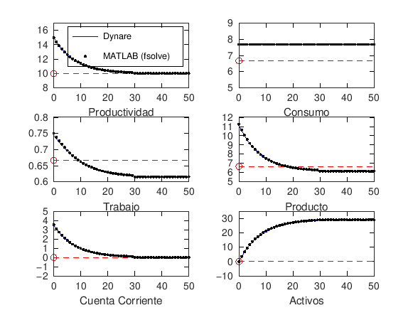
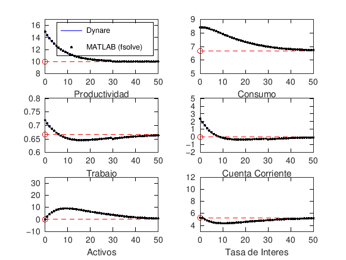

# Labs-Matlab-EcoIntII

Numerical solution of a deterministic small open economy (SOE) model with an
infinitely lived representative household and endogenous labor supply (Tema B1).
The codes compute the initial steady state and the transition (impulse responses
in levels) after a **temporary, unanticipated increase in productivity**, in two
versions:

| Model | Interest rate | MATLAB | Dynare |
|---|---|---|---|
| I | exogenous world rate (no risk premium) | `Matlab/ftransB1.m` (experiment I of `TemaB1.m`) | `Dynare/SOE_B1.mod` |
| II | endogenous, debt elastic risk premium | `Matlab/ftransB1b.m` (experiment II of `TemaB1.m`) | `Dynare/SOE_B1b.mod` |

The Dynare files reproduce the MATLAB results to machine precision (see
[Validation](#validation)). The model is described in `SOE.pdf`.

## Repository structure

```
SOE.pdf                         Model notes (equations and steady state)
Matlab/
  TemaB1.m                      Main script: calibration, steady state, both experiments, figures
  ftransB1.m                    Equilibrium conditions, model I (exogenous interest rate)
  ftransB1b.m                   Equilibrium conditions, model II (endogenous risk premium)
Dynare/
  SOE_B1.mod                    Dynare counterpart of ftransB1.m  (model I)
  SOE_B1b.mod                   Dynare counterpart of ftransB1b.m (model II)
  get_TemaB1_paths.m            Extracts the Dynare solution in the format of TemaB1.m
  plot_TemaB1.m                 Draws the same figures as TemaB1.m
  compare_matlab_dynare.m       Validation: runs MATLAB and Dynare and compares them
  figures/                      Figures produced by compare_matlab_dynare(true)
```

The original MATLAB codes are unchanged.

## The model

The household maximizes $\sum_t \beta^t \left[\ln c_t + \phi \ln(1-l_t)\right]$.
With the timing used in the codes ($t = 1, \dots, T$ is the row of the solution
matrix, $t = 1$ is the shock period and it is plotted as period 0; $s_t$ is the
stock of foreign assets at the **beginning** of period $t$), the equilibrium
conditions coded in `ftransB1.m` are

```math
\begin{aligned}
&\text{(fw)}  && w_t = \theta_t \\
&\text{(fl)}  && l_t = 1 - \phi\, c_t / w_t \\
&\text{(fy)}  && y_t = \theta_t\, l_t \\
&\text{(fca)} && ca_t = y_t - c_t + r_t\, s_t \\
&\text{(fs)}  && s_{t+1} = s_t + ca_t, \qquad s_1 = s_0 \\
&\text{(fc)}  && c_{t+1} = \beta (1 + r_{t+1})\, c_t, \quad t = 1,\dots,T-1, \qquad s_{T-1} = s_T
\end{aligned}
```

* **Model I** (`ftransB1.m`): $r_t = r^*_t$, the exogenous world rate, equal to
  $1/\beta - 1$ in every period.
* **Model II** (`ftransB1b.m`) adds the endogenous interest rate

```math
\text{(fr)} \qquad r_{t+1} = r^*_t - \chi\, s_t, \quad t = 1,\dots,T-1, \qquad r_1 = r^*_1 .
```

  Note that the code lets the premium react to assets with a one period lag
  with respect to eq. (8) of `SOE.pdf` ($r_t = r^w_t - \chi s_t$). The Dynare
  file replicates the code, not the pdf.

The last Euler equation is replaced by the terminal condition $s_{T-1} = s_T$
(the current account is zero at the end of the horizon).

**Calibration** (identical in both implementations): $\beta = 0.95$,
$r^* = 1/\beta - 1 \approx 0.0526$, $\phi = 0.5$, $s_0 = 0$, $\theta_0 = 10$,
$\chi = 0.001$ (model II), $T = 100$.

**Shock**: $\theta_1 = 15$ and $\theta_{t+1} = \theta_0 + 0.88(\theta_t - \theta_0)$
for $t = 1,\dots,29$; productivity is exactly $\theta_0$ from $t = 31$ on (the
AR(1) path is truncated after 30 periods). The economy is in the steady state at
$t = 0$ and the whole path becomes known at $t = 1$ (unanticipated, then perfect
foresight).

**Initial steady state** (both models):
$c = \frac{\theta_0}{1+\phi} + \frac{1}{1+\phi}\frac{1-\beta}{\beta}s_0 = 6.6667$,
$w = \theta_0 = 10$, $l = 1 - \phi c/w = 0.6667$, $y = \theta_0 l = 6.6667$,
$ca = 0$, $s = s_0 = 0$, $r = 1/\beta - 1 = 5.263\%$.
In model II this is also the unique steady state, since
$s^* = (r^w - (1/\beta - 1))/\chi = 0 = s_0$ (eq. 22 of `SOE.pdf`).

**Main results**

* Model I has a unit root (with $\beta(1+r^*) = 1$ any level of assets is a
  steady state). Consumption jumps to 7.678 and stays there; the household saves
  part of the temporary income (current account 3.48 on impact) and settles at a
  new steady state with assets 28.83, labor 0.616 and output 6.161.
* Model II is stationary. Consumption jumps to 8.413 and then declines towards
  6.667; assets peak at 9.12 (period 9) and return to zero, while the interest
  rate falls to 4.35% and goes back to 5.263%.

## MATLAB implementation

`TemaB1.m` stacks the equations for $t = 1,\dots,T$ and solves the $6T$
(model I) or $7T$ (model II) nonlinear equations with `fsolve`, starting from
the initial steady state. It plots the levels of the variables for periods
0 to 50 (red circle and dashed line: initial steady state):

* figure 1 (model I): productivity, consumption, labor, output, current account, assets;
* figure 2 (model II): productivity, consumption, labor, current account, assets, interest rate (in %).

Run it with `cd Matlab; TemaB1`.

## Dynare implementation

Both `.mod` files use Dynare's deterministic, perfect foresight framework
(`perfect_foresight_setup(periods=100)` and `perfect_foresight_solver`, a Newton
method on the stacked system), with the same horizon $T = 100$. The design makes
the stacked Dynare system **equation by equation identical** to the MATLAB system
$F(x) = 0$:

1. **Same equations and timing.** The model block writes the MATLAB equations
   literally: `ca = y-c+rst*s` and `s = s(-1)+ca(-1)` with `s` the beginning of
   period stock. Dynare period $t$ is row $t$ of the `fsolve` solution. Dynare
   period 0 (the initial condition) is the initial steady state, so
   $s_1 = s_0 + ca_0 = s_0$, exactly as `fs(1)`.
2. **Same shock.** Productivity is an exogenous variable (`theta`). Its path is
   built inside the `.mod` file with the same recursion as `TemaB1.m` and passed
   to Dynare with `shocks; var theta; periods 1:30; values (theta_shock); end;`.
   The world rate `rst` is also exogenous (constant at $r^*$, as in `TemaB1.m`),
   so interest rate experiments can be run as in the MATLAB code.
3. **Same boundary conditions.** Two exogenous indicators switch equations at the
   boundaries, as the MATLAB code does:
   * `dT` (1 only in period $T$) replaces the last Euler equation by
     $s_{T-1} = s_T$ (`fc(T)`):
     `(1-dT)*(c(+1)-beta*(1+rst(+1))*c) + dT*(s(-1)-s) = 0`;
   * `d1` (1 only in period 1, model II) imposes $r_1 = r^*_1$ (`fr(1)`):
     `r = d1*rst + (1-d1)*(rst(-1)-chi*s(-1))`.
4. **Same steady state.** `steady_state_model` contains the formulas of
   `TemaB1.m` (model I) and of `SOE.pdf` eqs. (15) and (20)-(22) (model II), which
   coincide under the calibration. `steady` and `resid` confirm that all static
   residuals are zero.

**Why the terminal condition must be imposed explicitly.** Dynare's default
terminal condition sets the forward looking variables at $T+1$ equal to a steady
state known in advance (`endval`/`steady`).

* In model I this is not possible: because of the unit root, the new steady state
  depends on the transition itself. Using the initial steady state as terminal
  condition, Dynare "converges" to a wrong path, with consumption fixed at 6.667
  and exploding assets ($s_{100} \approx 4626$), which violates the intertemporal
  budget constraint. Imposing $s_{T-1} = s_T$ as in MATLAB gives the right answer.
  Because the shock is truncated at $t = 30 < T$, this condition is also exact for
  the infinite horizon problem.
* In model II the default terminal condition is valid (the model is stationary),
  but with $\chi = 0.001$ the economy has not fully returned to the steady state
  at $T = 100$ ($s_{100} = 0.029$), so the MATLAB truncation $s_{99} = s_{100}$ and
  the Dynare default give slightly different paths near $T$. To replicate MATLAB,
  `SOE_B1b.mod` imposes the MATLAB condition by default. Running
  `dynare SOE_B1b -DMATLAB_TERMINAL=0 -DT=1000` uses the standard Dynare terminal
  condition with a long horizon (an approximation of the infinite horizon
  solution). Compared with it, the MATLAB truncation changes assets by at most
  3.4e-5 and consumption by 1.7e-6 over the plotted periods 0 to 50 (at most
  1.2e-2 and 6.0e-4 close to $t = 100$).

### Running the Dynare files

```matlab
addpath <dynare_folder>/matlab
cd Dynare
dynare SOE_B1          % model I : figure as figure(1) of TemaB1.m
dynare SOE_B1b         % model II: figure as figure(2) of TemaB1.m
```

After each run the workspace contains `soe_B1` and `ss_B1` (or `soe_B1b` and
`ss_B1b`): the transition paths with the same names as in `TemaB1.m` (`wt`, `lt`,
`yt`, `cat`, `st`, `ct`, `rste`, `tht`, periods $1,\dots,T$) and the initial
steady state (`wss`, `lss`, `yss`, `cass`, `s0`, `css`, `th0`, `rlong`). The full
solution is in `oo_.endo_simul` (column 1 is period 0, columns 2 to 101 are
periods 1 to 100) and is saved by Dynare in `SOE_B1/Output/SOE_B1_results.mat`
(Dynare 6).

## Validation

```matlab
addpath <dynare_folder>/matlab
cd Dynare
results = compare_matlab_dynare;        % or compare_matlab_dynare(true) to save the PNG figures
```

`compare_matlab_dynare.m` runs both `.mod` files, solves the original MATLAB
systems by calling `ftransB1.m` and `ftransB1b.m` unchanged (same globals,
initial guess and `fsolve` options as `TemaB1.m`, and again with tight
tolerances), and checks the steady state, the equilibrium conditions and the
IRFs. Results (Dynare 6.0 and GNU Octave 8.4; MATLAB was not available in the
test environment):

| Check | Model I | Model II |
|---|---|---|
| Initial steady state, max abs. difference | 0 | 0 |
| Productivity path, max abs. difference | 0 | 0 |
| Original MATLAB system evaluated at the initial steady state, max abs. residual | 8.9e-16 | 8.9e-16 |
| **Original MATLAB system evaluated at the Dynare solution**, max abs. residual | **3.6e-15** | **1.8e-15** |
| Max abs. difference in IRFs, Dynare vs `fsolve` (tight tolerance), all variables, $t = 1,\dots,100$ | 2.5e-13 (assets, of order 29); at most 1e-14 for the rest | 2.1e-14 |
| Dynare Newton iterations (final residual) | 3 (3.6e-15) | 5 (1.8e-15) |

The Dynare paths satisfy the original MATLAB equilibrium conditions to machine
precision, so both programs compute the same solution of the same system. The
same holds with an interest rate shock in periods 1 to 3 (residuals of 3.6e-15
and 2.7e-15), which confirms that the boundary conditions are replicated for any
exogenous path.

**Numerical tolerance of the original code.** `TemaB1.m` calls `fsolve` with its
default tolerances, so its output is an approximate solution whose accuracy
depends on the solver. In Octave 8.4 the default stopping rule is loose (max
residual 6.8e-3 in model I and 1.2e-3 in model II), and the "as run" solution
differs from the exact one by up to 0.33 in assets (model I) and 8.4e-3 (model
II); in MATLAB this gap is expected to be much smaller. These are `fsolve`
errors, not differences between the models: solving the same MATLAB system with
tight tolerances gives the Dynare solution up to 2.5e-13. `compare_matlab_dynare.m`
reports both comparisons.

Note for Octave users: `TemaB1.m` passes a T x 6 matrix as initial guess to
`fsolve`, which works in MATLAB but fails in Octave 8.4 (`__fdjac__:
nonconformant arguments`). `compare_matlab_dynare.m` calls the original functions
through a wrapper that reshapes the vector of unknowns (what MATLAB's `fsolve`
does internally), so it runs in both.

Figures produced by `compare_matlab_dynare(true)` (Dynare: lines; MATLAB
`fsolve` as run in Octave: dots):





## Requirements

* MATLAB with the Optimization Toolbox (`fsolve`) or GNU Octave, for the MATLAB codes.
* Dynare 5.x or 6.x for the `.mod` files (tested with Dynare 6.0 under GNU Octave
  8.4). The `.mod` files only use features available in these versions
  (`steady_state_model`, named equations, `perfect_foresight_setup`/`solver`,
  vector values in the `shocks` block).
